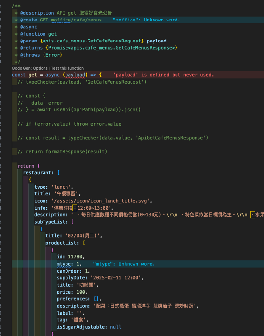
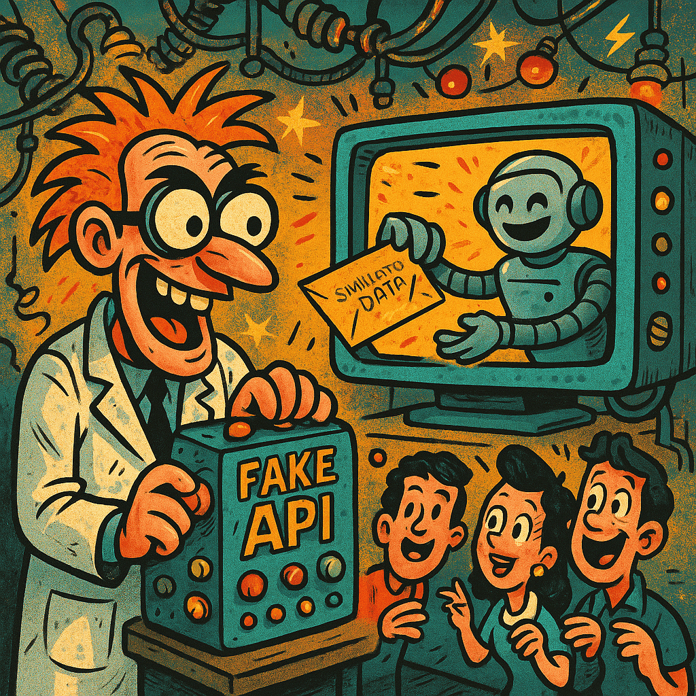
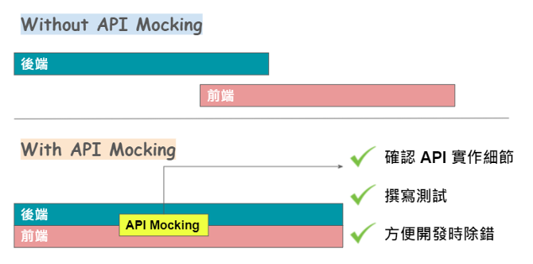
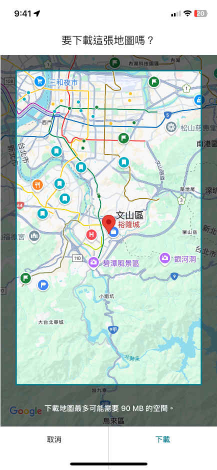
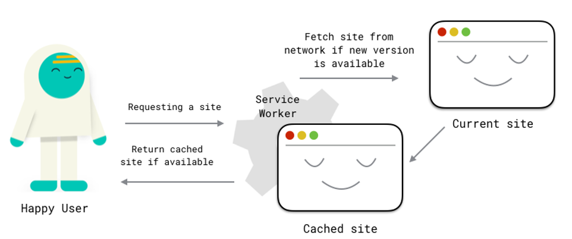
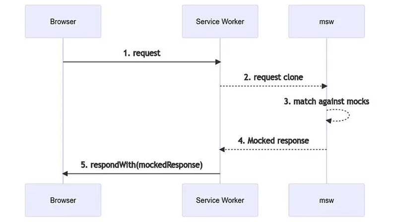
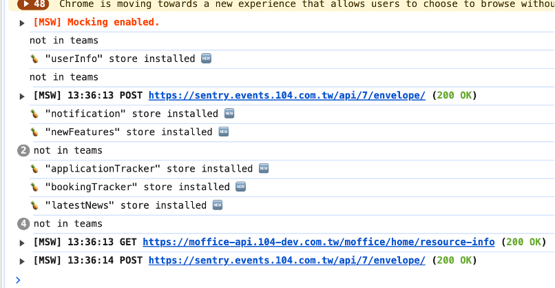
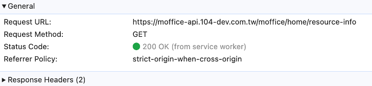

---
# You can also start simply with 'default'
theme: seriph
# random image from a curated Unsplash collection by Anthony
# like them? see https://unsplash.com/collections/94734566/slidev
background: "#aef5ff"
# some information about your slides (markdown enabled)
title: Welcome to Slidev
info: |
  ## Slidev Starter Template
  Presentation slides for developers.

  Learn more at [Sli.dev](https://sli.dev)
# apply unocss classes to the current slide
class: text-center
# https://sli.dev/features/drawing
drawings:
  persist: false
# slide transition: https://sli.dev/guide/animations.html#slide-transitions
transition: slide-left
# enable MDC Syntax: https://sli.dev/features/mdc
mdc: true
# open graph
# seoMeta:
#  ogImage: https://cover.sli.dev
---

# Mock Service Worker


---
transition: slide-left
---

# 什麼是 Mock Service Worker (MSW)

Mock Service Worker 是一個 API 模擬庫，它允許你編寫與客戶端無關的模擬，並在任何框架、工具和環境中重複使用它們。

- 用於瀏覽器和 Node.js 的 API 模擬函式庫。
- 可以攔截傳出的請求、觀察它們並使用模擬回應。
  <br>
  <br>

<!--
You can have `style` tag in markdown to override the style for the current page.
Learn more: https://sli.dev/features/slide-scope-style
-->

<style>
h1 {
  background-color: #2B90B6;
  background-image: linear-gradient(45deg, #4EC5D4 10%, #146b8c 20%);
  background-size: 100%;
  -webkit-background-clip: text;
  -moz-background-clip: text;
  -webkit-text-fill-color: transparent;
  -moz-text-fill-color: transparent;
}
</style>

---
transition: slide-left
---

# 為什麼有模擬 API 的需求

## 前後端分離

|                                                         |
| ------------------------------------------------------- |
| 後端 API 正在開發中，前端想要同時開發                   |
| 前端想要測試 API 回傳不同結果下，元件的操作邏輯是否正常 |


---
layout: two-cols
transition: slide-left
---

# 為什麼有模擬 API 的需求

##

<div class="mt-20">
  <p class="text-6">串接的程式先註解</p>
  </div>
  <arrow x1="270" y1="180" x2="480" y2="220" color="#953" width="2" arrowSize="1" />
<div class="mt-20">
    <p class="text-6">在 api 檔先回傳假資料</p>
  </div>
  <arrow x1="300" y1="280" x2="480" y2="320" color="#953" width="2" arrowSize="1" />

::right::



---

# 為什麼有模擬 API 的需求

## 寫死假資料可能會有什麼問題

<br>

- 需要對 code 頻繁修改，串接時還需要回去改 api 串接檔
- 想要模擬不同結果時需要一直回去改假資料
- 無法模擬 api 狀態錯誤例如：500
- 不能先撰寫測試



---
level: 2
---

# 為什麼有模擬 API 的需求

## 如果 Mock API

<br>

- 模擬動態回應以提升開發效率，程式運作更符合實際預期
- 模擬各種網路狀況（延遲、錯誤、特殊 HTTP 狀態等）
- 藉由修改 mock 的內容，幫助元件或頁面進行除錯。可以模擬如果 API 壞掉的情境
- 測試可以撰寫各種 HTTP 狀態，或是不同回應資料時的測試案例
- 前後端雙方也能透過 Mock API 的過程更具體討論實作細節



<!--
- 模擬動態回應以提升開發效率，並使程式運作更符合實際預期
- 依專案需要可模擬各種網絡狀況（延遲、錯誤、特殊 HTTP 狀態等）
- 藉由修改 mock 的內容，幫助元件或頁面進行除錯。可以模擬如果 API 壞掉
- 進行測試時，可以撰寫各種 HTTP 狀態，或是不同回應資料時的測試案例
- 前後端雙方也能透過 Mock API 的過程更具體討論實作細節
-->

---

# 前端有哪些 mock 的方式

## 1. 攔截 Request 請求

<br>

- 可用套件：Mock.js、axios-mock-adapter
- 透過攔截 XMLHttpRequest 並覆寫相關方法來達成 Mock 資料回傳。
- 沒有實際進行真正的網路傳輸
- 只要是依賴 XMLHttpRequest 方法的套件、工具都不能正常運作


---

# 前端有哪些 mock 的方式

## 2. 建立一個真正的 Server

<br>

- Json-server
- 建立一個 HTTP 伺服器（通常跑在 localhost:3000）
- 提供標準的 RESTful API 路由（例如 GET /posts、POST /comments）
- 額外寫 script 讓 server 在啟動前端開發環境時一起啟動，額外佔用一個 port


---

# 前端有哪些 mock 的方式

## 3. Service Worker

<br>

- 由瀏覽器提供的技術，主要用來提升網頁的性能、離線體驗和功能
- 不用額外起一個 server，也不影響到依賴 network level 層級的工具
- 同時支援 REST API 及 GraphQL
- 可直接在 dev tools 內查看

<p class="text-4 text-gray-600">主要功能：
離線訪問、網路請求攔截、推送通知、背景同步、資源預加載...</p>
<p class="text-4 text-gray-600">實際應用：
漸進式網頁應用（PWA）、Google Maps、新聞網站...</p>

<div class="flex h-40">


</div>

<!--
- 運行在瀏覽器後台的 JavaScript 腳本，獨立於網頁的主線程運行
- 核心概念是作為一個「中間人」，在網頁和網絡之間處理請求與響應
- 透過 cache 的機制來打造離線體驗
-->

---

# Mock Service Worker

##

- 能在網路層（Network）發出實際的請求（Request）
- 並透過 Service Worker 攔截，回傳已經定義好的資料內容



---
layout: two-cols
---

# Mock Service Worker

## handlers.js

[官網範例](https://mswjs.io/docs/basics/mocking-responses)

::right::

```js {all|2|5|7|none}
// 1. Import the "HttpResponse" class from the library.
import { http, HttpResponse } from "msw";

export const handlers = [
  http.get("/resource", () => {
    // 2. Return a mocked "Response" instance from the handler.
    return HttpResponse.text("Hello world!");
  }),
];
```

```js {all|4,5|none}
export const handlers = [
  http.get("/apples", () => {
    return new HttpResponse(null, {
      status: 404,
      statusText: "Out Of Apples",
    });
  }),
];
```

```js {all|2|4,5,6,7}
export const handlers = [
  http.post("/auth", () => {
    return new HttpResponse(null, {
      headers: {
        "Set-Cookie": "mySecret=abc-123",
        "X-Custom-Header": "yes",
      },
    });
  }),
];
```

<!--
- mock logic 的核心

[click] msw 提供的 api

[click] http.get

[click] response 一個字串

[click]

[click] 回傳 404

[click]

[click] http.post

[click] 回傳客制 header
-->

---
layout: two-cols
---

# Mock Service Worker

## handlers.js

行動辦公室實作 1

::right::

```js {all|3|8|9,10,11|16,17,18|20}
import { http, HttpResponse, passthrough } from "msw";
import { shouldUseRealApi } from "@/mocks/config";
import { orders } from "../../orders/mockData";

const apiPath = import.meta.env.VITE_API_URL + "/moffice/cafe/order";

export const cafeOrderIdHandlers = [
  http.get(`${apiPath}/:orderId`, ({ request, params }) => {
    if (shouldUseRealApi(request.url)) {
      return passthrough();
    }

    const orderId = parseInt(params.orderId);
    const order = orders.find((o) => o.id === orderId);

    if (!order) {
      return HttpResponse.json("找不到此訂單", { status: 200 });
    }

    return HttpResponse.json(order);
  }),
];
```

<!--
- mock logic 的核心

[click] 引入 mockData，待會會講到

[click] http.get

[click] 有提供 api 可讓我們設計開關去控制要打真實的 api 還是用 mock

[click] 如果沒找到回傳找不到

[click] 有找到則回傳正常的資料
-->

---
layout: two-cols
---

# Mock Service Worker

## handlers.js

行動辦公室實作 2

::right::

```js {all|8|16,17,18}
import { http, HttpResponse, passthrough } from "msw";
import { shouldUseRealApi } from "@/mocks/config";
import { checkOrderAvailable } from "./mockData";

const apiPath = import.meta.env.VITE_API_URL + "/moffice/cafe/available-order";

export const cafeAvailableOrderHandlers = [
  http.post(apiPath, async ({ request }) => {
    if (shouldUseRealApi(request.url)) {
      return passthrough();
    }
    const body = await request.json();

    // 驗證請求內容是否為陣列
    if (!Array.isArray(body)) {
      return HttpResponse.json("Invalid request format. Expected an array.", {
        status: 400,
      });
    }

    const ordersResponse = checkOrderAvailable(body);

    return HttpResponse.json(ordersResponse, { status: 200 });
  }),
];
```

<!--
- mock logic 的核心

[click] 上一個是 get，這裡也可以用 post

[click] 可以自己控制回傳錯誤碼
-->

---
layout: two-cols
---

# Mock Service Worker

## mockData.js

行動辦公室實作 1

::right::

```js
export const menus = {
  restaurant: [
    {
      type: "lunch",
      title: "午餐專區",
      icon: "/assets/icon/icon_lunch_title.svg",
      info: "供應時段：12:00~13:00",
      description:
        " ．每日供應數種不同價格便當(0~130元)。\r\n ．特色菜依當日標價為主。\r\n ．水果：15元/1份。\r\n ．白飯：購買便當者免費。",
      subTypeList: [
        {
          title: "02/04(周二)",
          productList: [
            {
              id: 11780,
              mtype: 1,
              canOrder: 1,
              supplyDate: "2025-02-11 12:00",
              title: "叻唦麵",
              price: 100,
              preferences: [],
              description: "配菜：日式蒸蛋 醋溜洋芋 蒜燒茄子 現炒時蔬",
              label: "",
              tag: "麵食",
              isSugarAdjustable: null,
            },
          ],
        },
        {
          title: "02/05(周三)",
          productList: [
            {
              id: 11740,
              mtype: 1,
              canOrder: 1,
              supplyDate: "2025-02-05 12:00",
              title: "蝦蝦便當",
              price: 85,
              preferences: [],
              description: "",
              label: "",
              tag: "便當",
              isSugarAdjustable: null,
            },
            {
              id: 11790,
              mtype: 1,
              canOrder: 1,
              supplyDate: "2025-02-05 12:00",
              title: "很好吃的便當",
              price: 85,
              preferences: [],
              description: "",
              label: "",
              tag: "便當",
              isSugarAdjustable: null,
            },
          ],
        },
      ],
    },
  ],
};
```

<!--
- 所有 mockData 集中處，避免 handlers 過於冗長
-->

---

# Mock Service Worker

## 啟動成功後

<div class="grid grid-cols-2 gap-10 mt-10">
  
  
</div>

---

# Mock Service Worker

## 優點

<br>

- 允許發出可以使用 DevTools 檢查的實際 HTTP 請求
- 可模擬動態請求參數回應、網絡延遲、錯誤狀況等
- 可以用於測試程式碼，不必為 HTTP 回應設定額外的測試模擬。
- 跟許多框架、工具都有很好的整合性，像是 Vue、React、Jest、Cypress 等。
- 針對主流的 API 設計－RESTful 和 GraphQL 都有良好的支援。
- 不須特別設定就能直接使用 TypeScript，享受強型別帶來的便利與好處。
- 清楚好閱讀的官方文件，並且有範例程式，讓開發者能好上手。

---

# Mock Service Worker

## 專案效益：有沒有解決問題

<br>

- 一開始便可以寫完成的程式，不用修改 code
- 想要模擬不同結果時只需要調整 handler 跟 mockData，不需要動到 code
- 可以模擬不同 http 狀態例如 500、404
- 可以先撰寫 api 檔測試

---

# 與其他模擬方法比較

<br>

| 方法                 | 優點                                                                                         | 缺點                                     |
| -------------------- | -------------------------------------------------------------------------------------------- | ---------------------------------------- |
| Mock Service Worker  | 客戶端操作，無需獨立 server<br/>可模擬網絡行為<br/>易整合測試框架<br/>易於前端快速開發和測試 | 檔案較大<br/>複雜 API 還是需要寫邏輯     |
| API 檔模擬假數據     | 簡單易用<br/>可模擬網絡行為<br/>維護成本低<br/>性能優秀                                      | 數據靜態<br/>無網路模擬行為<br/>真實性低 |
| Mock Service Worker  | 客戶端操作，無需獨立 server<br/>可模擬網絡行為<br/>易整合測試框架<br/>易於前端快速開發和測試 | 檔案較大<br/>複雜 API 還是需要寫邏輯     |
| Express 後端模擬數據 | 可提供完整功能<br/>高度靈活<br/>真實性高<br/>支持動態數據                                    | 設置較複雜<br/>需額外啟動伺服器          |

<!--
1. 客戶端網絡攔截：
  - MSW：直接模擬 API 回應，而不依賴後端基礎設施。前端開發者可以在無後端的情況下快速模擬 API，尤其適合單獨開發前端或測試時使用。
  - Express：必須運行一個服務器來處理請求。如果要模擬 API，需要啟動服務器並配置路由，無法直接在客戶端攔截請求。

2. 整合前端測試框架：
  - MSW：與 Jest、Cypress、Vitest 等測試框架深度整合，允許在測試中輕鬆模擬 API 回應。它能模擬真實的網絡行為（如延遲、錯誤）
  - Express：需要在測試中啟動和管理服務器（例如使用 supertest）。這增加了測試設置的複雜度

3. 零配置：
  - MSW：提供簡單及多種的 API（如 rest.get() 或 graphql.query()）來定義模擬回應，無需搭建完整服務器。專注於快速模擬，減少設置時間。
  - Express：需要手動定義路由、中間件和回應邏輯，設置過程較繁瑣。
-->

---

# 未來展望

<br>

- 封裝 MSW 統一出口，方便未來調整或更換套件
- 隨著專案發展，可進一步結合 MSW 與自動化測試管道
- 根據實際需求，持續調整模擬策略，確保與真實 API 能夠無縫銜接
- 持續探索各種可能性，選擇最適合專案的方法

---

# Learn More

## [MSW](https://mswjs.io/docs/)

<br>

## [slidev](https://sli.dev)
