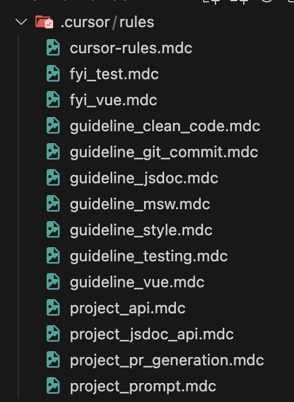
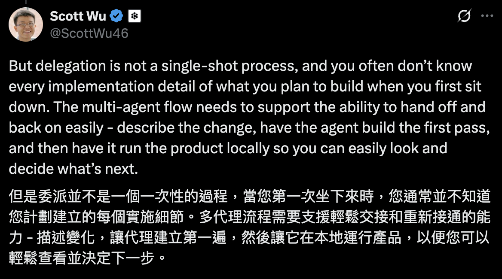
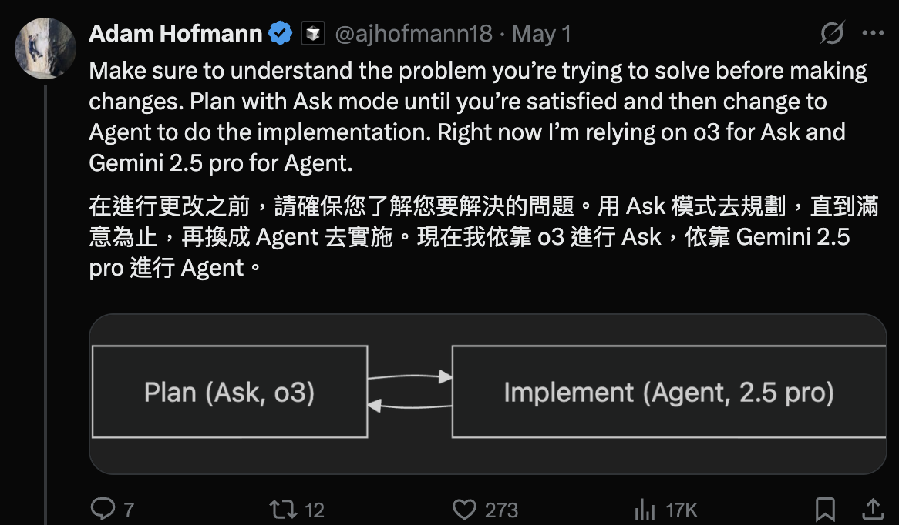
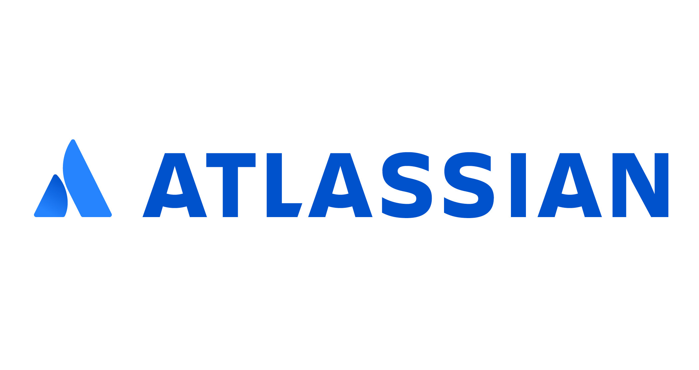
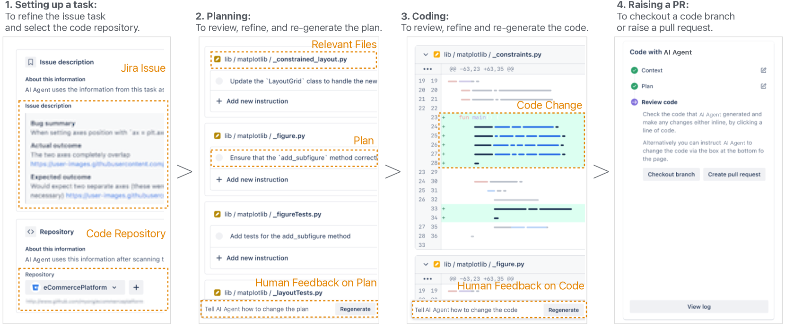
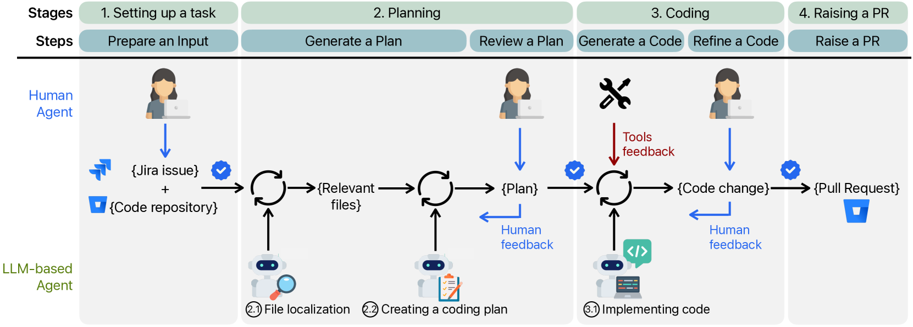
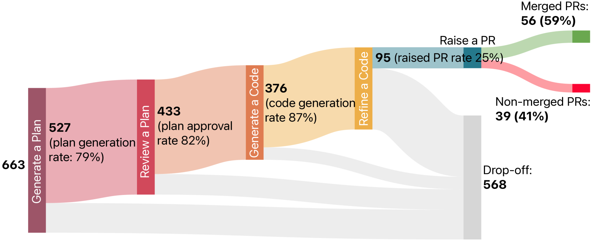

---
# You can also start simply with 'default'
theme: seriph
# random image from a curated Unsplash collection by Anthony
# like them? see https://unsplash.com/collections/94734566/slidev
background: "ffffff"
# some information about your slides (markdown enabled)
title: Welcome to Slidev
info: |
  ## Slidev Starter Template
  Presentation slides for developers.

  Learn more at [Sli.dev](https://sli.dev)
# apply unocss classes to the current slide
class: text-center
# https://sli.dev/features/drawing
drawings:
  persist: false
# slide transition: https://sli.dev/guide/animations.html#slide-transitions
transition: slide-left
# enable MDC Syntax: https://sli.dev/features/mdc
mdc: true
# open graph
# seoMeta:
#  ogImage: https://cover.sli.dev
---

# AI 使用分享

---
transition: slide-left
---

# Agenda

<ul>
  <li class="text-28px">Cursor Rules</li>
  <li class="text-28px">Commit Message</li>
  <li class="text-28px">README</li>
  <li class="text-28px">人類工程師介入</li>
  <li class="text-28px">Atlassian HULA 簡介</li>
  <li class="text-28px">日常使用</li>
</ul>

---
layout: two-cols
transition: slide-left
---

# Cursor Rules

<ul>
  <li class="text-24px font-bold">cursor-rules.mdc</li>
  <li class="text-24px font-bold">
    guideline
    <ul class="text-20px font-400">
      <li>git commit</li>
      <li>jsdoc</li>
      <li>testing</li>
      <li>vue</li>
    </ul>
  </li>
  <li class="text-24px font-bold">
    project
    <ul class="text-20px font-400">
      <li>api</li>
      <li>prompt</li>
    </ul>
  </li>
</ul>

::right::

---

# README

##

 

<ul class="text-28px">
  <li>mockHandler</li>
  <li>errorTracker</li>
</ul>

---
level: 2
---

# 人類工程師介入仍很重要

 

### AI 代理定義：可以在不用人類介入的狀況下，根據指定目標，去完成相關任務

 

### 相比於完全沒有人類介入的狀況，適時的人類工程師介入 (human-in-the-loop)，往往能夠獲得更好的成果

---

# 人類工程師介入仍很重要

 

#### Devin 的創辦人兼執行長 Scott Wu：

 

> 要把任務委派給 AI 代理，不會是一次性的過程 (not a single-shot process)

 

- 「全球首個 AI 軟體工程師」- 能夠在人類指定目標後，就自動運行直到發出一個解決方案的 PR (pull request)
- 2025 年 Devin 進一步推出 2.0 時，從原本全自動化，轉為人機共同協作

 

---

# 釐清好問題

#### Cursor 團隊的工程師 Adam Hofmann：

 

> 「在你足夠理解問題以及你想要的解決方案前，不要叫 AI 代理幫你做事」

> 「don’t ask agent to do something until you understand the problem and solution that you want to see. 」

 

- 釐清問題這件事本身，也可以運用 AI 來協助（例如可以寫下你目前對問題的理解，然後問 AI 是否還有遺漏沒有想清楚的面向、或者問能否點出潛在的假設漏洞）
- 撰文者特別推薦，在問題釐清階段可以使用推理模型

---

# 建置好讓 AI 能夠成功完成任務的基礎

 

> 假如今天一個剛加入團隊的新成員，即使這位新成員很聰明，但假如該成員不知道團隊的程式碼庫風格、不能使用團隊平常有在用的工具，這位成員可能如預期發揮自己百分百的水準嗎?

 

- 團隊程式碼庫風格指南 (style guide)
  - 
風格一致的程式碼

- 過去不同功能的設計文件 (design doc)
  - 
先理解原本的設計脈絡，進而讓程式碼更符合設計初衷

- 靜態檢查工具 (例如 linter)
  - 
生成出的程式碼更符合團隊的規範

讓 AI 更精準地完成我們期望 AI 完成的任務，這樣將能夠有效減少後續人類的介入與改動。

---

# 建置好讓 AI 能夠成功完成任務的基礎

 

#### 在執行任務時會用到的外部工具 (MCP)

提供 Jira 的 MCP，Cursor 就能自動從 Jira 中抓取相關規格或需求描述，工程師甚至不需要手動輸入需求，只需告訴 Cursor「根據 Jira 的某張 ticket 來實作功能」，即可完成任務。

---

# 任務拆小 + 適時給予回饋

 

<ul class="text-20px">
  <li>對比起從頭到尾的全自動化，目前業界摸索出比較有效的方式，是人與 AI 的共同協作</li>
  <li>把任務拆小，讓 AI 能夠去執行不同的子任務，並在子任務的進行途中持續給予回饋</li>
</ul>

 
 

#### Atlassian 研究 <a href="https://arxiv.org/abs/2411.12924">《Human-In-the-Loop Software Development Agents》</a>

把完整開發流程拆成四個階段，每個階段都由人類工程師的指示搭配 AI 代理去完成

他們的研究發現，比起一次要求 AI 完成完整的任務，這種拆小的方式，得出來的品質比較好

---

# HULA (Human-in-the-Loop LLM-based Agents Framework)

## HULA 是什麼？

 

<ul>
  <li>結合大型語言模型 (LLMs) 和軟體工程師人工介入的框架</li>
  <li>目標是輔助軟體開發任務，例如從 JIRA 問題自動產生程式碼</li>
  <li>不是要完全取代人工，而是希望促進人機協作 (Human-AI synergy)</li>
  <li>框架被設計、實作並整合到 Atlassian JIRA 中供內部使用</li>
</ul>

  

---

# HULA (Human-in-the-Loop LLM-based Agents Framework)

 

---

# HULA 如何運作？

  <h4 class="text-blue-600">三種「代理人」(Agents)</h4>
  <ul>
    <li>AI 規劃代理人 (AI Planner Agent)</li>
    <li>AI 程式代理人 (AI Coding Agent) </li>
    <li>人類代理人 (Human Agent) (也就是軟體工程師)</li>
  </ul>

  <h4 class="text-blue-600">四個階段</h4> 
  <ul>
    <li>設定任務 (Setting up a task)</li>
    <li>規劃 (Planning)</li>
    <li>編碼 (Coding)</li>
    <li>提出 PR (Raising a Pull Request)</li>
  </ul>

 

---
transition: slide-left
---

# HULA 評估與成果

進行了多階段評估：離線評估、線上評估和使用者問卷調查。

離線評估（用資料集）

<table class="text-14px bg-gray-200">
  <thead>
    <tr>
      <th>指標</th>
      <th>SWE-bench 驗證</th>
      <th>內部</th>
    </tr>
  </thead>
  <tbody>
    <tr>
      <td>成功產生計畫的議題百分比</td>
      <td>97%</td>
      <td>100%</td>
    </tr>
    <tr>
      <td>檔案定位召回率</td>
      <td>86%</td>
      <td>30%</td>
    </tr>
    <tr>
      <td>完美檔案定位的議題百分比</td>
      <td>84%</td>
      <td>15%</td>
    </tr>
    <tr>
      <td>完美通過測試案例的議題百分比</td>
      <td>31%</td>
      <td>–</td>
    </tr>
    <tr>
      <td>高程式碼相似度的議題百分比</td>
      <td>45%</td>
      <td>30%</td>
    </tr>
  </tbody>
</table>

  
線上評估（實際使用）

  

---

# HULA 重要啟示

 

<ul class="text-24px">
  <li>輸入資訊的細節程度對 LLMs 代理人的表現影響很大</li>
  <li>核心是「人工介入」(Human-in-the-loop)：人工回饋的重要性，在流程的每個階段都允許工程師提供回饋和指導。</li>
  <li>人機協作，1+1＞2</li>
</ul>

---

# 日常使用

  

  
釐清好問題

  <ul>
    <li>GPT o3</li>
    <li>Grok thinking</li>
    <li>Gemini 2.5 flash</li>
    <li>Cursor Agent + Claude-3.7-Sonnet</li>
    <li>NotebookLM</li>
  </ul>
  

  

  
建置好讓 AI 能夠成功完成任務的基礎

  <ul>
    <li>Cursor Rules</li>
    <li>Docs</li>
    <li>MCP</li>
    <li>README</li>
  </ul>

  

 

  
任務拆小 + 適時給予回饋

  <ul>
    <li>分次給任務，一次約 1~5 個小任務</li>
  </ul>

---

# 日常使用

 

  <h4>最常用提示詞</h4>
  <ul class="mt-2">
    <li>幫我實作...功能</li>
    <li>跟我解釋這段</li>
    <li class="text-orange-600">調整成可讀性較高的寫法</li>
  </ul>

  <h4>其他工具</h4>
  <ul>
    <li>Gamma</li>
    <li>Felo</li>
    <li>Perplxity</li>
  </ul>

---
layout: two-cols
---

# 日常使用

<h2>AI 資訊獲取</h2>

 

  

    <h4>技術類</h4>
    <ul>
      <li>iHower</li>
      <li>保哥</li>
      <li>尹相治</li>
      <li>高見龍</li>
      <li>莫力全</li>
      <li>harryspeaks</li>
    </ul>
  

  

    <h4>財經類</h4>
    <ul>
      <li>股癌</li>
      <li>曼尼</li>
      <li>IEObserve</li>
      <li>李柏鋒</li>
      <li>M 觀點</li>
    </ul>
  

::right::

  

    
img:nth-child(3n+1)]:mt-4
         [&>img:nth-child(3n+2)]:mt-8
         [&>img:nth-child(3n)]:mt-0"
>
  
  
  
  
  
  
  
  
  
  
  

  

---

# 本日大事

## Claude 4 推出

## 灰狼 v.s 雷霆

---

# 本日大事

## 今天禮拜五 TGIF
